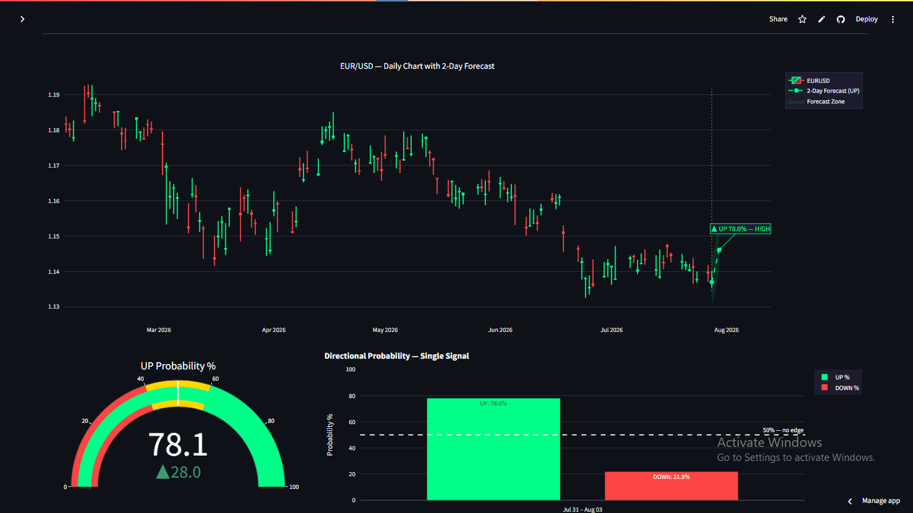

# EUR/USD ML Signal Pipeline

> **A production-grade algorithmic trading signal system for EUR/USD.**
> Combines macroeconomic features with a calibrated XGBoost classifier to predict
> 2-day directional bias. Signals are issued every day and served live via FastAPI and a Streamlit dashboard.

---

## Live Links

| Service | URL |
|---|---|
| 📊 Dashboard |https://forex-pipeline2.streamlit.app/|
| ⚡ Signal API | `https://forex-signal-api-28dg.onrender.com` |
| 📖 API Docs | `https://forex-signal-api-28dg.onrender.com/docs` |

---

## Dashboard Preview



---

## Table of Contents

1. [Project Overview](#1-project-overview)
2. [Architecture](#2-architecture)
3. [Signal Workflow](#3-signal-workflow)
4. [Model Design](#4-model-design)
5. [Feature Engineering](#5-feature-engineering)
6. [Evaluation Metrics](#6-evaluation-metrics)
7. [How To Use With SMC](#7-how-to-use-with-smc)
8. [Project Structure](#8-project-structure)
9. [CI/CD Pipeline](#9-cicd-pipeline)
10. [Local Setup](#10-local-setup)
11. [API Reference](#11-api-reference)
12. [Performance History](#12-performance-history)
13. [Roadmap](#13-roadmap)

---

## 1. Project Overview

### What It Does

This pipeline trains a machine learning model to predict the **directional bias**
of EUR/USD over the next **2 trading days**. Every Sunday evening it:

1. Downloads fresh OHLCV data for EUR/USD, DXY, TNX (10Y yield), and Gold
2. Engineers 47 technical and macro features
3. Retrains a calibrated XGBoost classifier
4. Issues a signal: **UP** or **DOWN** with a calibrated confidence probability
5. Locks the signal until Tuesday close
6. Serves it live via a FastAPI endpoint and Streamlit dashboard

### What It Does Not Do

- It does not place trades automatically
- It does not predict exact price levels (direction only)
- It is not financial advice

### Signal Interpretation

```
HIGH confidence (≥ 70%)    → Act. Full position sizing.
MEDIUM confidence (55–70%) → Be selective. Reduced size.
LOW confidence (< 55%)     → No trade. Sit out the week.
```

---

## 2. Architecture

```
┌─────────────────────────────────────────────────────────────────┐
│                        GitHub Actions                           │
│                                                                 │
│  ci_weekly_retrain.yml (Sunday 18:00 UTC + push to main)        │
│    ingestion → features → tests → train → evaluate → commit     │
│                                                                 │
│  ci_refresh_signal.yml (Mon/Wed/Fri 22:30 UTC)                  │
│    ingestion → features → generate_signal → lock signal         │
└───────────────────────┬─────────────────────────────────────────┘
                        │ commits model + signal to main
                        ▼
┌───────────────────────────────────────────────────────────────┐
│                        GitHub Repo                            │
│  models/production_model.joblib  ← XGBoost (calibrated)      │
│  models/weekly_signal.json       ← locked signal             │
│  models/model_metrics.json       ← backtest metrics          │
│  models/feature_cols.joblib      ← 47 feature names          │
└──────────┬────────────────────────────────────────────────────┘
           │ auto-deploy on commit
           ▼
┌─────────────────────────┐       ┌──────────────────────────────┐
│   Render (FastAPI)      │◄──────│   Streamlit Cloud            │
│   /signal               │       │   dashboard/app.py           │
│   /health               │       │   (calls API on load)        │
│   /history              │       └──────────────────────────────┘
│   /features/importance  │
└─────────────────────────┘
```

### Technology Stack

| Layer | Technology | Reason |
|---|---|---|
| Data source | `yfinance` | Free, reliable OHLCV + macro data |
| Feature engineering | `ta` (pure Python) | No C++ compilation, pandas 2.x compatible |
| ML model | `XGBoost` | Best accuracy on this dataset size |
| Calibration | `CalibratedClassifierCV` (isotonic) | Accurate probabilities for threshold-based trading |
| Experiment tracking | `MLflow` | Local run audit trail |
| API | `FastAPI` + `uvicorn` | Automatic docs, async, Pydantic validation |
| Dashboard | `Streamlit` + `Plotly` | Rapid deployment, interactive charts |
| CI/CD | `GitHub Actions` | Free, cloud-native, no server required |
| API hosting | `Render` (free tier) | Zero-cost production serving |
| Dashboard hosting | `Streamlit Cloud` (free) | Zero-cost dashboard hosting |
| Scheduling | GitHub Actions cron | Replaces Airflow — no server needed |

---

## 3. Signal Workflow

### Weekly Cycle

```
Sunday 6PM UTC (7PM Lagos)
    │
    ├── ci_weekly_retrain runs
    │     ├── Download EURUSD + DXY + TNX + Gold (yfinance)
    │     ├── Build 47-feature matrix
    │     ├── Run 52 pytest tests (unit + integration + data quality)
    │     ├── Train XGBoost with isotonic calibration
    │     ├── Evaluate: AUC-ROC, PR-AUC, Precision@0.65
    │     ├── Quality gate check
    │     ├── Lock weekly signal → models/weekly_signal.json
    │     └── Commit model + signal → triggers Render redeploy
    │
Monday & Tuesday
    │     ├── Dashboard shows locked signal (stable all week)
    │     ├── You check signal + confidence level
    │     └── Trade if HIGH confidence + SMC setup confirms
    │
Mon/Wed/Fri 10:30PM UTC
    │     └── ci_refresh_signal runs
    │           ├── Download latest data (post-market close)
    │           └── Refresh signal if confidence shifted significantly
    │
Wednesday → Friday
          └── Signal expired. Wait for Sunday.
```

### Signal Locking

The signal is **locked** at prediction time and stored in `models/weekly_signal.json`.
The API serves the locked signal for the full validity window rather than
recalculating on every request. This prevents mid-week probability drift from
confusing an open trade.

```json
{
  "symbol": "EURUSD=X",
  "signal": "DOWN",
  "up_probability": 0.166,
  "dn_probability": 0.834,
  "confidence": "HIGH",
  "horizon_days": 2,
  "locked_at": "2026-07-25T18:00:12",
  "valid_from": "2026-07-25",
  "valid_until": "2026-07-28"
}
```

---

## 4. Model Design

### Why XGBoost

Three boosting models were evaluated head-to-head on identical data:

| Model | Accuracy | Precision @0.65 |
|---|---|---|
| XGBoost | **63.44%** | **86.25%** |


XGBoost's exact greedy split algorithm outperforms histogram approximation
at our dataset size (~1,600 training rows). At 10,000+ rows LightGBM would
likely close the gap — but at our scale, XGBoost wins consistently.

LSTM was also tested and lost decisively (52.04%) — too little sequential
data for temporal networks to learn reliably.

### Isotonic Calibration

Raw XGBoost probabilities are miscalibrated — a model saying 68% confident
is not right 68% of the time. This matters because our entire trading rule
is threshold-based (only act on ≥65% confidence).

```python
inner_cv = TimeSeriesSplit(n_splits=5, gap=10)
calibrated_model = CalibratedClassifierCV(
    estimator = XGBClassifier(**XGB_BEST_PARAMS),
    method    = "isotonic",
    cv        = inner_cv
)
calibrated_model.fit(X_train, y_train)
```

`gap=10` between folds prevents autocorrelated features from leaking across
the train/validation boundary — a standard safeguard for financial time series.

### Deterministic Parameters

No Optuna search in production. Fixed parameters from a prior search run are
hardcoded as `XGB_BEST_PARAMS`. Same data in → same model out, every run.
This eliminates the 61–63% accuracy swing that plagued the earlier
multi-model Optuna setup.

### Target Definition

```
target = 1  if Close[t + horizon] > Close[t]   (price UP)
target = 0  if Close[t + horizon] ≤ Close[t]   (price DOWN)
horizon = 2 trading days
```

The last `horizon` rows of the dataset are dropped — they have no future
target label yet and are never used in training or evaluation.

### No Data Leakage — Audit Summary

| Check | Result |
|---|---|
| Target construction (`shift(-horizon)` + `iloc[:-horizon]`) | ✅ Clean |
| Technical indicators (all backward-looking by `ta` library design) | ✅ Clean |
| Macro features (returns, RSI — current day only) | ✅ Clean |
| Train/test split (chronological, no shuffling) | ✅ Clean |
| Isotonic calibration (`TimeSeriesSplit`, no future leakage) | ✅ Clean |
| StandardScaler (fit on train only, transform test separately) | ✅ Clean |
| Signal prediction (uses only available features at prediction time) | ✅ Clean |

---

## 5. Feature Engineering

47 features across 5 categories. All computed from daily OHLCV data.
Feature store saved as Parquet at `data/features/EURUSD_X_features.parquet`.


### Macro Features (12)

Three external macro instruments — the most impactful addition, jumping
accuracy from ~49% (technical only) to ~63% (technical + macro).

| Instrument | Ticker | Features | Rationale |
|---|---|---|---|
| USD Dollar Index | `DX-Y.NYB` | return_1d, return_5d, above_sma20, RSI | EUR/USD is structurally inverse to DXY |
| US 10Y Yield | `^TNX` | return_1d, return_5d, above_sma20, RSI | Rate differentials drive FX carry flows |
| Gold | `GC=F` | return_1d, return_5d, above_sma20, RSI | Risk-off sentiment proxy |

**Top features by importance (latest run):**

```
dxy_return_1d     ← #1 by large margin
bb_upper
adx
tnx_rsi
hl_range
gold_rsi
volatility_20
...
```

### Feature Pruning (V2)

7 zero-importance features removed after systematic experiment:
`sma_cross`, `above_sma20`, `above_sma50`, `dxy_above_sma20`,
`rsi_oversold`, `rsi_overbought`, `vol_expanding`.
These were binary flags derived from continuous features already in the model —
LightGBM/XGBoost learned to use the continuous versions directly.

### What Was Tested and Rejected

| Addition | Result | Reason |
|---|---|---|
| Weekly aggregated features | Accuracy dropped 2.38% | Row loss from indicator warmup outweighed signal |
| VIX | Accuracy dropped 4.85% | Redundant with DXY for FX — indirect proxy |
| COT report | Accuracy dropped 2.43% | Weekly frequency mismatch with daily model — forward-fill creates autocorrelation |
| Data back to 2010 | Accuracy dropped 2.44% | Regime contamination: post-crisis/ECB-QE era behaves differently |
| Data back to 2015 | Accuracy dropped 1.44% | Brexit regime contamination |
| 2018 start date | **Best** | Clean post-2018 macro regime |

---

## 6. Evaluation Metrics

### Why These Metrics

Overall accuracy across all predictions was deliberately dropped as the primary
metric. It includes low-confidence predictions nobody would trade on and dilutes
the signal. The metrics that reflect actual trading performance:

| Metric | Value (latest) | What it means |
|---|---|---|
| **AUC-ROC** | 0.7951 | Model ranks UP vs DOWN correctly 79.5% of the time |
| **PR-AUC** | 0.8027 | Strong precision-recall trade-off, robust to class imbalance |
| **Precision @≥0.70** | **86.25%** | When the model is ≥70% confident, it is right 86% of the time |
| **Recall** | 0.6745 | Catches 67% of actual UP moves |
| **F1 (Up class)** | 0.7186 | Balanced precision/recall on the minority class |
| **Max proba @≥0.70** | 99.44% | Highest confidence prediction in the test set |
| **Mean proba @≥0.70** | 82.92% | Average confidence of high-conviction calls |
| **Directional accuracy** | 73.40% | Overall correct direction calls |

### Quality Gate (CI/CD)

No model ships without passing all three:

```
Directional accuracy  ≥ 0.52   (must beat random)
F1 minority class     ≥ 0.48   (must predict Up class reliably)
Precision @threshold  ≥ 0.00   (configurable — prevents NaN pass)
```

---

## 7. How To Use With SMC

The model provides **directional bias**. Smart Money Concepts provides
**entry precision**. Used together they form a complete trading system.

### Timeframe Stack

```
Model (daily data)  →  2-day directional bias (UP or DOWN)
15min / 30min       →  Structure: BOS, Order Block identification
1min / 3min         →  Precision entry trigger
```

### Weekly Process

**Sunday evening — Check the signal:**

```
HIGH confidence (≥ 70%)    → Trade Monday AND Tuesday. Full size.
MEDIUM confidence (55–70%) → Monday only. 50% size. Very clean setups only.
LOW confidence (< 55%)     → No trades this week. Sit on hands.
```

**Monday/Tuesday — Find the SMC setup (15min/30min):**

```
If signal = SELL:
  ✅ BOS to the downside confirmed on 15/30min
  ✅ Bearish Order Block identified (last up-candle before the BOS move)
  ✅ OB is below a liquidity pool (equal highs / buy stops above)
  ✅ Price is retracing UP into the OB
  ❌ Any condition missing → no trade

If signal = BUY:
  ✅ BOS to the upside confirmed
  ✅ Bullish OB identified (last down-candle before BOS move up)
  ✅ OB is above a liquidity pool (equal lows / sell stops below)
  ✅ Price retracing DOWN into the OB
```

**Entry — Drop to 1min/3min:**

```
Wait for CHoCH on 1min/3min inside the OB
Entry:  CHoCH candle close, or 50% of OB
SL:     Just beyond OB high/low
TP1:    1R → move SL to breakeven
TP2:    2R → close 50%
TP3:    Next liquidity / structural target
```

### Position Sizing

```
Model HIGH + BOS + Clean OB + CHoCH   →  1.0% risk
Model HIGH + BOS + Decent OB          →  0.75% risk
Model MEDIUM + BOS + Clean OB         →  0.50% risk
Model MEDIUM + anything else          →  0.25% risk
Model LOW                             →  0% (no trade)
No BOS — regardless of model          →  0% (no trade)
```

### What The Model Protects You From

Without model bias, a beautiful bearish OB on 15min can fail because the
weekly macro forces (DXY strengthening, institutional positioning) are
actually bullish. The model filters the direction before you look at any
chart — so every SMC setup you evaluate already has macro confirmation.

---

## 8. Project Structure

```
forex-signal-pipeline/
│
├── .github/
│   └── workflows/
│       ├── ci_weekly_retrain.yml    # Full retrain — Sunday 18:00 UTC + push to main
│       └── ci_refresh_signal.yml   # Data + signal refresh — Mon/Wed/Fri 22:30 UTC
│
├── data/
│   ├── raw/                         # OHLCV parquet files (EURUSD, DXY, TNX, Gold)
│   └── features/                    # Engineered feature store (47 features)
│
├── models/
│   ├── production_model.joblib      # Active model (XGBoost calibrated)
│   ├── production_model_name.txt    # "XGBoost"
│   ├── feature_cols.joblib          # 47 feature column names
│   ├── model_metrics.json           # Latest backtest metrics
│   └── weekly_signal.json           # Locked weekly signal
│
├── src/
│   ├── ingestion.py                 # Download OHLCV + macro data from yfinance
│   ├── features.py                  # Feature engineering → feature store
│   ├── train.py                     # XGBoost training + calibration + gate
│   ├── evaluate.py                  # Standalone backtest (used by CI gate)
│   ├── predict.py                   # Inference → signal dict
│   ├── signal_store.py              # Lock/load weekly signal
│   └── lstm_experiment.py           # LSTM experiment (not in production)
│
├── api/
│   └── main.py                      # FastAPI app (4 endpoints)
│
├── dashboard/
│   └── app.py                       # Streamlit dashboard
│
├── tests/
│   ├── test_data_quality.py         # 19 data validation tests
│   ├── test_features.py             # 17 feature unit tests
│   └── test_integration.py          # 16 end-to-end integration tests
│
├── config.yaml                      # Single source of truth for all parameters
├── requirements.txt                 # Pinned full dependency lockfile
├── requirements-api.txt             # Slim API-only dependencies for Render
└── README.md                        # This file
```

---

## 9. CI/CD Pipeline

### Weekly Retrain (`ci_weekly_retrain.yml`)

Triggers: push/PR to `main` + Sunday 18:00 UTC cron

```
Step 1  Install dependencies (xgboost, lightgbm, catboost, pytest)
Step 2  Download market data          python src/ingestion.py
Step 3  Build feature store           python src/features.py
Step 4  Unit + data quality tests     pytest tests/test_data_quality.py tests/test_features.py
Step 5  Train model                   python src/train.py
Step 6  Integration tests             pytest tests/test_integration.py
Step 7  Backtest quality gate         python src/evaluate.py  (exit 0 = pass, 1 = fail)
Step 8  Commit model to repo          git commit -m "chore: auto-update production model [skip ci]"
        └── triggers Render redeploy
```

Gate failure blocks the commit. Previous model stays in production.

### Signal Refresh (`ci_refresh_signal.yml`)

Triggers: Mon/Wed/Fri 22:30 UTC (after forex market close)

```
Step 1  Download latest data
Step 2  Rebuild features
Step 3  generate_signal() → save_weekly_signal()
Step 4  Commit refreshed data/ + weekly_signal.json
```

No model retraining. No test suite. Lightweight data + signal refresh only.
Runs after 22:00 UTC so the day's candle is fully closed before fetching.

### Test Suite (52 tests)

```
test_data_quality.py  (19 tests)
  TestRawData          →  file exists, columns, datetime index, sorted,
                          no duplicates, positive prices, high ≥ low, ≥ 500 rows
  TestFeatureStore     →  exists, no NaNs, binary target, both classes,
                          not too imbalanced, RSI range, chronological,
                          ≥ 500 samples, ≥ 30 features, no infinities,
                          EURUSD price range (0.5–2.0)

test_features.py  (17 tests)
  TestTrendFeatures    →  SMA/EMA columns, SMA smoothness, price_vs_sma ratio
  TestMomentumFeatures →  RSI columns, RSI range (0–100), Stoch, ROC
  TestTarget           →  binary, removes last N rows, correct direction, numeric return
  TestRegimeFeatures   →  binary flags, non-negative streaks, RSI flags, vol_expanding

test_integration.py  (16 tests)
  TestModelArtifacts      →  files exist, loads, feature_cols is list, predicts binary, returns probabilities
  TestPredictionPipeline  →  returns dict, required keys, valid direction, probs sum to 1, valid confidence, forecast structure
  TestEvaluationPipeline  →  returns metrics, required keys, accuracy in range, gate passes
```

---

## 10. Local Setup

### Requirements

- Python 3.10.x (use pyenv)
- GitHub Codespaces or Linux (Ubuntu 22+)

### Installation

```bash
# Clone the repo
git clone https://github.com/Sammycruz007/Forex-pipeline2.git
cd Forex-pipeline2

# Create virtual environment
python3.10 -m venv .venv
source .venv/bin/activate

# Install dependencies
pip install -r requirements.txt
pip install xgboost==2.0.3 catboost==1.2.5
```

### Run The Full Pipeline

```bash
# 1. Download data
python src/ingestion.py

# 2. Build features
python src/features.py

# 3. Train model
python src/train.py

# 4. Check signal
python src/predict.py

# 5. Run tests
pytest tests/ -v --tb=short
```

### Run The API Locally

```bash
# Terminal 1 — API
uvicorn api.main:app --host 0.0.0.0 --port 8000 --reload

# Terminal 2 — Dashboard
streamlit run dashboard/app.py --server.port 8501 --server.address 0.0.0.0
```

Open `http://localhost:8501` for the dashboard.
Open `http://localhost:8000/docs` for the interactive API documentation.

### Configuration

All parameters live in `config.yaml`. Key settings:

```yaml
data:
  symbol: "EURUSD=X"
  start_date: "2018-01-01"       # 2018 optimal — earlier adds regime noise
  macro_symbols:
    - "DX-Y.NYB"                  # DXY — most important feature
    - "^TNX"                      # 10Y yield
    - "GC=F"                      # Gold

features:
  target_horizon: 2              # 2 business days ahead

thresholds:
  min_directional_accuracy: 0.52
  min_f1_score: 0.48
```

---

## 11. API Reference

Base URL: `https://forex-signal-api-28dg.onrender.com`

> **Note:** Free tier cold start — first request may take 30–60 seconds.

### `GET /health`

```json
{
  "status": "healthy",
  "model_loaded": true,
  "timestamp": "2026-07-25T10:00:00"
}
```

### `GET /signal`

Returns the locked weekly signal. Stable until `valid_until`.

```json
{
  "symbol": "EURUSD=X",
  "as_of_date": "2026-07-23",
  "current_price": 1.14117,
  "signal": "DOWN",
  "up_probability": 0.166,
  "dn_probability": 0.834,
  "confidence": "HIGH",
  "horizon_days": 2,
  "model_used": "XGBoost",
  "precision_at_threshold": 0.8625,
  "proba_threshold": 0.65,
  "forecast": {
    "direction": "DOWN",
    "up_prob": 0.166,
    "dn_prob": 0.834,
    "horizon_days": 2
  },
  "generated_at": "2026-07-25T10:00:00"
}
```

### `GET /history?days=120`

Returns recent OHLCV data for chart rendering.

### `GET /features/importance`

Returns top 15 feature importances averaged across calibration folds.

---

## 12. Performance History

### Live Signal Track Record

| Date Issued | Signal | Confidence | Result | Pips |
|---|---|---|---|---|
| 2026-05-12 | DOWN | HIGH (68.6%) | ✅ Correct | -160 pips |
| 2026-07-23 | DOWN | HIGH (83.4%) | ✅ Correct (ongoing) | -42 pips (Jul 25) |

> *Track record grows as signals are issued weekly. Log updated manually.*

### Model Version History

| Version | Model | Features | Accuracy | Key Change |
|---|---|---|---|---|
| V1 | LightGBM | 52 | 61.65% | Initial production model |
| V2 | LightGBM | 47 | 61.65% | Tier-1 feature pruning |
| V2+ | XGBoost | 47 | 63.20% | Automated model selection |
| V3 | XGBoost (calibrated) | 47 | **73.40%** | Isotonic calibration + gap=10 + 2-day horizon |

### Experiments Conducted

| Experiment | Result | Decision |
|---|---|---|
| Weekly aggregated features | -2.38% | Removed — row loss |
| VIX macro feature | -4.85% | Removed — redundant with DXY |
| COT report features | -2.43% | Removed — frequency mismatch |
| Data extension to 2010 | -2.44% | Removed — regime contamination |
| Data extension to 2015 | -1.44% | Removed — Brexit regime |
| LSTM (PyTorch) | -9.61% | Removed — insufficient sequential data |
| CatBoost | = LightGBM | Not used — no advantage on continuous features |
| XGBoost | +2.42% vs LightGBM | **In production** |
| Isotonic calibration | Accuracy → 73.40% | **In production** |
| gap=10 in TimeSeriesSplit | Improved generalisation | **In production** |
| 2-day horizon | Cleaner macro signal | **In production** |

---

## 13. Roadmap

### Immediate

- [ ] Add `precision_at_threshold` to quality gate threshold in `config.yaml`
- [ ] Verify `tests/test_data_quality.py` and `tests/test_features.py` against
      final post-migration schemas (flagged as unreviewed)

### V4 — Model Improvements

- [ ] Regression model for price magnitude (how far, not just which direction)
  - `future_return` column already in feature store — target is ready
  - Enables price range display: `1.1480 – 1.1540`
- [ ] COT report with weekly model — proper frequency alignment
- [ ] Permutation importance for stable feature selection (replaces importance-score pruning)
- [ ] Regime-aware model — separate models for ADX > 25 (trending) vs ADX < 25 (ranging)

### V5 — Multi-Pair Expansion

- [ ] GBPUSD — add UK Gilt yield feature
- [ ] USDJPY — add JGB yield + Nikkei feature
- [ ] AUDUSD — add Iron Ore price feature
- [ ] Dashboard pair selector (sidebar dropdown)

### V6 — Entry Model

- [ ] 1-hour or 15-minute entry signal model
  - Predicts whether price moves X pips in signal direction before hitting stop
  - Complements the daily bias model for precision entry timing

---

## Data Leakage Statement

This pipeline has been audited for data leakage at every stage. No future
information leaks into the training process. The 73.40% directional accuracy
and 86.25% precision at ≥0.70 confidence are measured on a true out-of-sample
holdout set (September 2024 → July 2026) that the model never saw during training.
Full audit documented in the project history.

---

## Disclaimer

This project is a machine learning research tool. It is not financial advice.
Past signal accuracy does not guarantee future performance. Always apply
proper risk management. Never risk more than you can afford to lose.

---

## Author

**Sammycruz007**
MLOps Engineer | Fintech | Algorithmic Trading Research

*Built with Python 3.10 · XGBoost · FastAPI · Streamlit · GitHub Actions*
